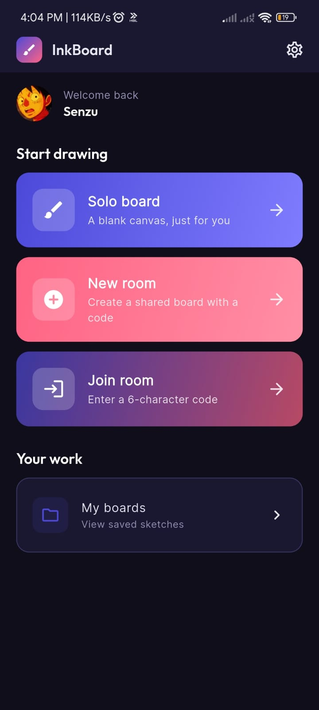
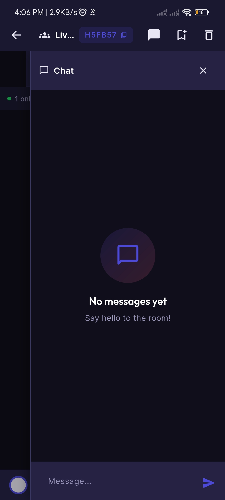
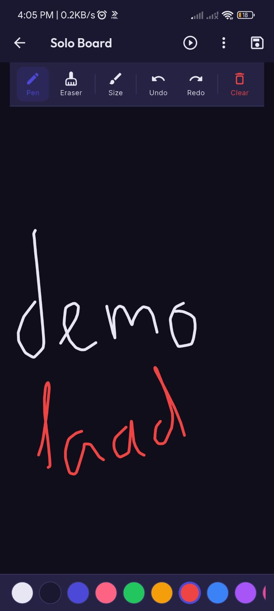
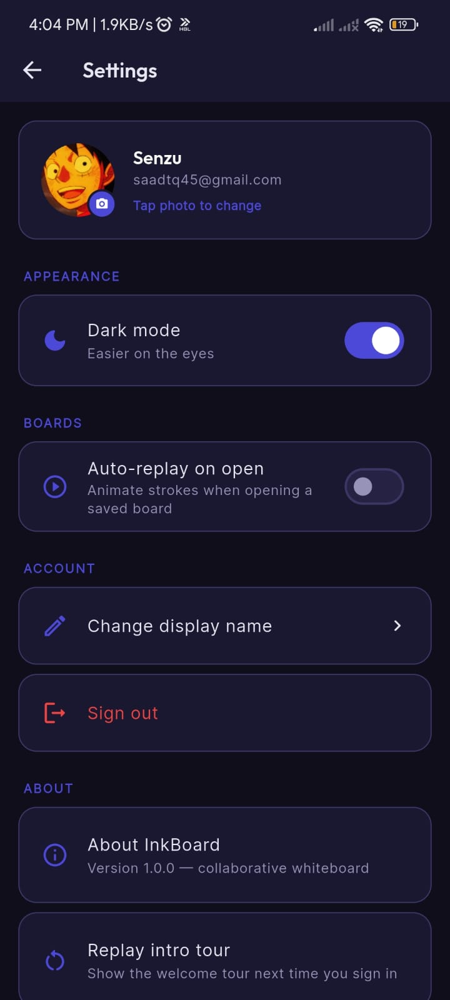
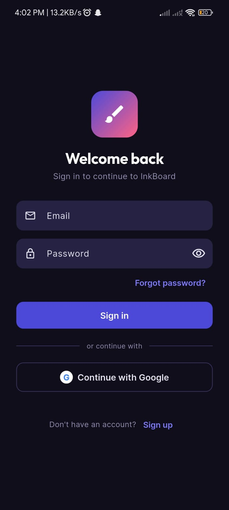
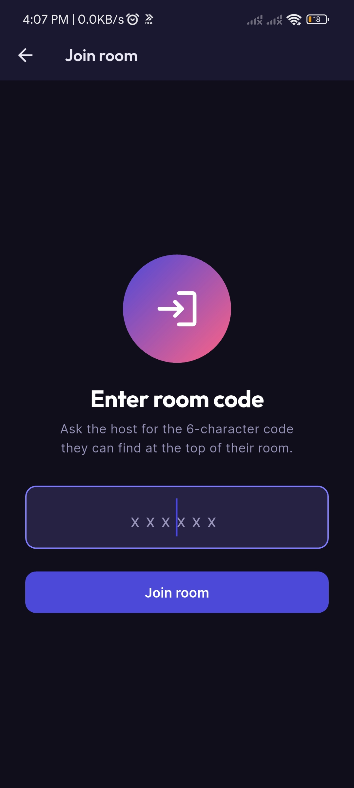

# InkBoard

A collaborative cross-platform whiteboard application built using Flutter and Firebase that enables multiple users to draw together in real time, communicate through integrated chat, and collaborate inside shared rooms.

## Features

### Authentication

* Email/password authentication
* Google Sign-In support
* Password reset functionality
* User profile management

### Real-Time Collaboration

* Shared drawing rooms
* Multi-user synchronized canvas
* Live stroke broadcasting using Firestore
* User presence tracking
* Typing indicators

### Drawing System

* Smooth Bezier-based stroke rendering
* Pen and eraser tools
* Undo / Redo support
* Theme-aware eraser
* Adjustable stroke thickness
* Replay animation support

### Communication

* Real-time room chat
* User avatars and profile pictures
* Presence indicators

### Customization

* Light/Dark themes
* Persistent user preferences
* Onboarding state persistence

## Tech Stack

* Flutter
* Dart
* Firebase Authentication
* Cloud Firestore
* Provider State Management
* Shared Preferences

## Project Structure

```text
lib/
├── models/
├── providers/
├── screens/
├── services/
├── theme/
├── utils/
├── widgets/
└── main.dart
```

## Installation

Clone the repository:

```bash
git clone https://github.com/muhammadsaad45/InkBoard-Collaborative-Whiteboard.git
cd InkBoard
```

Install dependencies:

```bash
flutter pub get
```

Configure Firebase:

1. Create Firebase project
2. Add Android/iOS/Web apps
3. Run:

```bash
flutterfire configure
```

Run application:

```bash
flutter run
```

## Firebase Features Used

* Authentication
* Firestore Database
* Real-time Synchronization

## Contributors

* Muhammad Saad Tariq (FA23-BCS-073)
* Muhammad Bin Imran (FA23-BCS-062)
* Muhammad Ammar Rauf (FA23-BCS-059)
* Muhammad Kaab Bhinder (FA23-BCS-068)

## Academic Context

Developed as the final project for CSC303 Mobile Application Development at COMSATS University Islamabad.

## Screenshots

| Home | Chat | Board |
|------|------|------|
|  |  |  |

| Settings | Login | Join |
|----------|-------|------|
|  |  |  |
